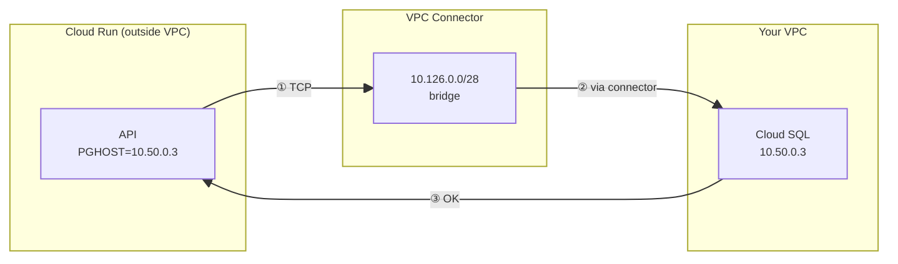
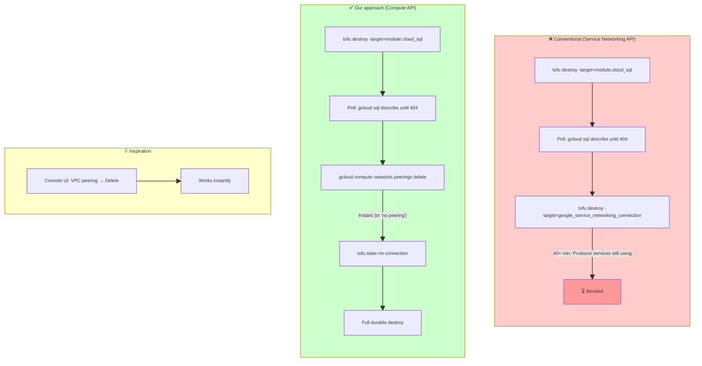

# WAR_STORIES_GCP

A curated list of **non-trivial technical war stories**, capturing real lessons suitable for **senior-level interviews**.

# GCP-Specific War Stories

---

## 1. Unified Google Gen AI SDK: One Interface, Two Auth Paths

**creation:** `<260227>`
**last_updated:** `<260227>`

**keywords:** Google Gen AI, python-genai, AI Studio, Vertex AI, authentication, unified SDK, Gemini
**difficulty:** 6
**significance:** 8

### 1.1 Context

In late 2024, Google launched the `google-genai` library ([github.com/googleapis/python-genai](https://github.com/googleapis/python-genai)), merging two previously separate Python APIs into one unified interface. Previously, developers used `google-generativeai` for AI Studio (Gemini Developer API) and `google-cloud-aiplatform` for Vertex AI—two different SDKs, two different call patterns. The new SDK handles both: once the client is initialized, `client.models.generate_content()` and `generate_content_stream()` are identical regardless of backend.

### 1.2 The Authentication Hurdle

**The critical gotcha:** AI Studio and Vertex AI use **different authentication mechanisms**, and the unified SDK does not hide this. Each backend has its own official way to authenticate and connect.

| Backend | Auth | Env vars (optional) | Code |
|---------|------|---------------------|------|
| **AI Studio** | API key string | `GEMINI_API_KEY` or `GOOGLE_API_KEY` (latter takes precedence) | `genai.Client(api_key='...')` or `genai.Client()` |
| **Vertex AI** | Service account / ADC | `GOOGLE_GENAI_USE_VERTEXAI=true`, `GOOGLE_CLOUD_PROJECT`, `GOOGLE_CLOUD_LOCATION` | `genai.Client(vertexai=True, project='...', location='...')` |
| **Vertex AI (org-restricted)** | Explicit credentials | `GOOGLE_APPLICATION_CREDENTIALS` + JSON key | Load with `google.oauth2.service_account.Credentials.from_service_account_file()`; pass `credentials=creds` |

**Enterprise restriction:** Many GCP organizations disable Standard API Keys via org policy. In that case, you cannot use AI Studio's API key path; you must use Vertex AI with a service account.

### 1.3 Key Insight

> One SDK, two auth paths. The unified interface is a win—same `generate_content()` and `generate_content_stream()` calls—but you must explicitly choose and configure the auth path. Design your `client_factory` to branch on env vars (`GCP_LLM_USE_VERTEX_AI`, `GOOGLE_AI_API_KEY`) so switching is configuration-only.

### 1.4 Resolution

1. **AI Studio path:** `client = genai.Client(api_key='...')` or set `GEMINI_API_KEY` / `GOOGLE_API_KEY`.
2. **Vertex AI path (ADC):** `client = genai.Client(vertexai=True, project='...', location='...')`—SDK uses `GOOGLE_APPLICATION_CREDENTIALS` or GKE/VM metadata.
3. **Vertex AI path (org-restricted):** Load credentials with `google.oauth2.service_account.Credentials.from_service_account_file(path, scopes=['https://www.googleapis.com/auth/cloud-platform'])` and pass `credentials=creds`.

### 1.5 Takeaway

For GCP LLM readiness: (1) Use `google-genai` for both AI Studio and Vertex AI. (2) Start with AI Studio (API key) for simplicity; upgrade to Vertex AI when compliance or Workload Identity is required. (3) Never hardcode which backend to use—branch on env vars. (4) In VMs/containers on GCP, Vertex AI with Workload Identity or ADC auto-authenticates and auto-refreshes tokens; no JSON key needed. See `docs/REFACTOR_PLAN_GCP_READINESS.md` for the full plan.

---

## 2. Anthropic Claude 529 Overloaded: Intermittent Failures, Alternative Models, and Retriable vs Non-Retriable Errors

**creation:** `<260227>`
**last_updated:** `<260227>`

**keywords:** Anthropic, Claude API, 529 overloaded_error, intermittent failures, model fallback, retriable errors, verify polling
**difficulty:** 6
**significance:** 7

### 2.1 Context

During GCP deploy verification, the QueryStream endpoint repeatedly failed with:

```json
{"message": "Agent processing failed: Error code: 529 - {'type': 'error', 'error': {'type': 'overloaded_error', 'message': 'Overloaded'}, 'request_id': '...'}"}
```

Deploy succeeded; verify failed. A single-call model test (`test_available_model.py`) sometimes passed, giving a false sense that the setup was fine. At other times, 10 consecutive calls with 2s intervals produced 8× 529 and 2× 500 errors—zero successes. The problem was intermittent and model-specific: `claude-haiku-4-5` (the default) was heavily overloaded.

### 2.2 Root Cause

Anthropic's API returns **529 (Overloaded)** and **500 (Internal server error)** when capacity is saturated. These are **transient**—retrying later often succeeds. The popular `claude-haiku-4-5` model sees the most traffic and overloads first. Older or higher-tier models (Sonnet, Opus) share different capacity pools and can remain available when Haiku 4.5 is overloaded.

Our verify script initially treated any error event in the SSE stream as non-retriable and failed fast. That was correct for 404 (model not found) and auth errors, but wrong for 529/500—those should keep polling.

### 2.3 Alternative Models and Comparison

We tested four Claude models for availability and overload resistance:

| Model | Input ($/MTok) | Output ($/MTok) | Latency (1 call) | Relative speed |
|-------|----------------|-----------------|------------------|----------------|
| **claude-haiku-4-5** | $1.00 | $5.00 | ~0.68s | Fastest (~49 tok/s) |
| **claude-3-haiku-20240307** | $0.25 | $1.25 | ~0.78s | Fast |
| **claude-sonnet-4-5** | $3.00 | $15.00 | ~1.75s | Medium (~20 tok/s) |
| **claude-opus-4-5** | $5.00 | $25.00 | ~1.86s | Slower (~19 tok/s) |

**Cost (1M in + 1M out):** Haiku 4.5 $6, Haiku 3 $1.50, Sonnet 4.5 $18, Opus 4.5 $30. `claude-3-haiku-20240307` is 4× cheaper than Haiku 4.5 but deprecated (retires April 2026).

**Best choices by criterion:**
- **Fastest:** claude-haiku-4-5
- **Cheapest:** claude-3-haiku-20240307
- **Most capable:** claude-opus-4-5
- **Fallback when Haiku overloads:** claude-3-haiku-20240307 or claude-sonnet-4-5

### 2.4 Resolution

1. **Verify script:** Updated `_is_non_retriable_query_error()` to treat `overloaded_error`, `api_error`, `rate_limit`, and `internal server error` as **retriable**. Verify now keeps polling instead of failing fast on 529/500.

2. **Reproducibility test:** Added `tools/gcp/standalone/temp_one_off/test_overload_529.py`—10 consecutive calls with 2s interval—to reproduce intermittent overload. Single-call tests are insufficient.

3. **Multi-model tests:** Extended `test_available_model.py` and `test_overload_529.py` to run against all four models with well-formatted logging and a final summary table.

4. **Fallback strategy:** Documented alternative models. When `claude-haiku-4-5` is overloaded, switch `CLAUDE_MODEL` in `.env` to `claude-3-haiku-20240307` (cheapest) or `claude-sonnet-4-5` (more capable) and redeploy.

### 2.5 Takeaway

(1) Anthropic 529/500 are transient—treat them as retriable in verify and retry logic. (2) Single-call model tests can pass during brief windows; use consecutive-call tests to catch intermittent overload. (3) Keep a list of fallback models (older Haiku, Sonnet, Opus) and switch via env when the default is overloaded. (4) Distinguish non-retriable errors (404, auth) from retriable ones (529, 500, rate limit) so you fail fast on config bugs but keep polling on capacity issues.

---

## 3. Cloud Run → Cloud SQL: VPC Connector Required (Unlike ECS in VPC)

**creation:** `<260227>`
**last_updated:** `<260227>`

**keywords:** Cloud Run, Cloud SQL, VPC connector, Serverless VPC Access, private IP, Terraform wiring
**difficulty:** 7
**significance:** 9

### 3.1 Context

On AWS, ECS Fargate tasks run **inside** the VPC. They reach Aurora via private IP directly. On GCP, Cloud Run runs **outside** the VPC by default. Cloud SQL has a private IP inside your VPC. Without a bridge, the API container cannot reach the database.

### 3.2 Root Cause

Cloud Run is a serverless platform that runs containers in Google-managed infrastructure. It does not automatically join your VPC. Cloud SQL uses Private Service Access to get a private IP in your VPC. To connect them, you need a **Serverless VPC Access connector**—a small subnet (e.g. 10.126.0.0/28) that acts as a bridge between Cloud Run and your VPC.



### 3.3 Terraform Wiring

| Stack | Creates | Outputs |
|-------|---------|---------|
| **durable** | VPC, Private Service Access, Cloud SQL, VPC connector | `vpc_connector_id`, `cloud_sql_private_ip`, `cloud_sql_database_name` |
| **nonkube** | Cloud Run module | Reads `remote_state.shared_durable`; passes `vpc_connector_id`, `env_vars` (PGHOST, PGPORT, ...), `secret_ids` (PGPASSWORD) |
| **cloud_run module** | `vpc_access { connector = vpc_connector_id, egress = PRIVATE_RANGES_ONLY }` | Enables egress to private IPs via connector |

### 3.4 Key Insight

> Cloud Run is not in VPC like ECS Fargate. You must create a VPC connector in the durable stack and pass it to Cloud Run. Set `vpc_access.egress = PRIVATE_RANGES_ONLY` so traffic to 10.x.x.x goes through the connector. See `docs/learned/cloud_shared/GCP_API_CLOUD_SQL_WIRING.md`.

### 3.5 Takeaway

(1) Durable stack creates VPC connector; nonkube stack passes it to Cloud Run. (2) Cloud Run Job (Spark) needs the same connector to reach Cloud SQL. (3) Without `vpc_access`, Cloud Run would try to reach 10.50.0.3 over the public internet and fail. (4) Reference: `docs/learned/cloud_shared/GCP_API_CLOUD_SQL_WIRING.md`.

---

## 4. GCS vs S3 State Backend: GCS Has Built-in Locking (No DynamoDB)

**creation:** `<260227>`
**last_updated:** `<260227>`

**keywords:** Terraform, OpenTofu, state backend, GCS, S3, DynamoDB, locking
**difficulty:** 5
**significance:** 7

### 4.1 Context

AWS Terraform state uses **S3 + DynamoDB**: S3 stores the state file; DynamoDB provides locking to prevent concurrent runs from corrupting state. GCP uses **GCS** for state. GCS has **built-in locking**—no separate lock table required.

### 4.2 Comparison

| Aspect | AWS | GCP |
|--------|-----|-----|
| **State storage** | S3 bucket | GCS bucket |
| **Locking** | DynamoDB table (separate) | Built into GCS backend |
| **Backend block** | `backend "s3" { bucket, key, dynamodb_table, region }` | `backend "gcs" { bucket, prefix }` |
| **Bootstrap** | Create S3 bucket + DynamoDB table | Create GCS bucket only |

### 4.3 Key Insight

> When implementing GCP, do not copy `dynamodb_table` or `dynamodb_table_name` from AWS. GCS backend uses `prefix` (e.g. `fru/dev/us-central1/gcp-shared-durable.tfstate`) and handles locking internally. Bootstrap state backend for GCP: create only the GCS bucket.

### 4.4 Takeaway

(1) `tools/gcp/scope_shared/deploy/bootstrap_state_backend.py` creates only the GCS bucket. (2) `backend_config()` in `terra_init.py` must pass `backend="gcs"` and `bucket`, `prefix`—no `dynamodb_table`. (3) State key format: `{prefix}/{env}/{region}/{stack_id}.tfstate` (e.g. `gcp-shared-durable.tfstate`).

---

## 5. Artifact Registry vs ECR: Different Image Paths and Auth

**creation:** `<260227>`
**last_updated:** `<260227>`

**keywords:** Artifact Registry, ECR, GCP, AWS, container registry, docker push
**difficulty:** 6
**significance:** 8

### 5.1 Context

AWS ECR uses `{account_id}.dkr.ecr.{region}.amazonaws.com/{repo}:{tag}`. GCP Artifact Registry uses `{region}-docker.pkg.dev/{project_id}/{repo}/{image}:{tag}`. Auth and CLI differ.

### 5.2 Comparison

| Aspect | AWS (ECR) | GCP (Artifact Registry) |
|--------|-----------|--------------------------|
| **URL format** | `123456789.dkr.ecr.us-east-1.amazonaws.com/fru-app:latest` | `us-central1-docker.pkg.dev/my-proj/fru-app-repo/app:latest` |
| **Auth** | `aws ecr get-login-password` → `docker login` | `gcloud auth configure-docker {region}-docker.pkg.dev` |
| **Create repo** | `aws ecr create-repository` | `gcloud artifacts repositories create` (or Terraform) |
| **Terraform** | `aws_ecr_repository` | `google_artifact_registry_repository` |

### 5.3 Key Insight

> `build_and_push_images.py` for GCP must use `gcloud artifacts docker` or `docker push` with Artifact Registry URL. Do not reuse ECR URLs or `aws ecr get-login-password`. The image path structure is different; ensure `artifact_registry_repo_app` and `artifact_registry_repo_spark` resolve to the correct `{region}-docker.pkg.dev/{project}/{repo}/...` format.

### 5.4 Takeaway

(1) Enable **Artifact Registry API** in GCP Console before first deploy. (2) `gcloud auth configure-docker {region}-docker.pkg.dev` for local dev. (3) In CI/GKE, use Workload Identity or service account; no `docker login` needed when pushing from GKE. (4) Reference: `tools/gcp/scope_shared/deploy/build_and_push_images.py`.

---

## 6. GCP Required APIs: Enable Before First Deploy

**creation:** `<260227>`
**last_updated:** `<260227>`

**keywords:** GCP, APIs, enable, Cloud Storage, Cloud SQL, GKE, Artifact Registry
**difficulty:** 4
**significance:** 7

### 6.1 Context

GCP requires specific APIs to be enabled per project. Unlike AWS (where most services work once IAM is configured), GCP APIs are opt-in. If an API is not enabled, Terraform or CLI calls fail with cryptic errors like "API not enabled" or "Permission denied."

### 6.2 Required APIs (for this project)

| API | Purpose | Notes |
|-----|---------|-------|
| **Cloud Storage API** | GCS buckets, state | Use "Cloud Storage API" (not just "Cloud Storage") |
| **Cloud SQL Admin API** | Cloud SQL | **Needs to be enabled** |
| **Kubernetes Engine API** | GKE | **Needs to be enabled**; propagation can take minutes |
| **Artifact Registry API** | Container images | **Needs to be enabled** for pushing Docker images |
| **Secret Manager API** | Secrets | For durable_with_cooloff |
| **Serverless VPC Access API** | VPC connector | For Cloud Run → Cloud SQL |

### 6.3 Key Insight

> Enable APIs in **APIs & Services → Library** before running Terraform. `doctor.py` can check for common APIs; document the full list in `REFACTOR_PLAN_GCP_READINESS.md`. If a deploy fails with "API not enabled" or 403, enable the missing API and retry.

### 6.4 Takeaway

(1) Create a checklist in `doctor.py` or `docs/` for required APIs. (2) Kubernetes Engine API enablement can take a few minutes to propagate. (3) Service account must have roles that allow use of these APIs (e.g. `roles/run.admin`, `roles/sql.admin`).

---

## 7. GCP State Bucket Naming: project_id vs account_id

**creation:** `<260227>`
**last_updated:** `<260227>`

**keywords:** Terraform, state bucket, GCP, AWS, naming, project_id, account_id
**difficulty:** 5
**significance:** 6

### 7.1 Context

AWS state bucket uses `{prefix}-{component}-{env}-{region}-{account_id}`. GCP uses `{prefix}-{component}-{env}-{region}-{project_id}`. The last identifier differs: AWS uses the 12-digit account ID; GCP uses the project ID string.

### 7.2 Comparison

| Cloud | Identifier | Example |
|-------|------------|---------|
| **AWS** | `get_account_id()` via `aws sts get-caller-identity` | `fru-tf-state-dev-us-east-1-123456789012` |
| **GCP** | `GCP_PROJECT_ID` from env | `fru-tf-state-dev-us-central1-my-gcp-project` |

### 7.3 Key Insight

> `resolve_state_bucket()` in `tools/gcp/scope_shared/core/backend.py` must use `GCP_PROJECT_ID`, not `get_account_id()`. GCP has no `sts get-caller-identity` equivalent; project ID is the canonical identifier. Ensure `GCP_PROJECT_ID` is set in `.env` before deploy.

### 7.4 Takeaway

(1) `tools/aws/backend.py` calls `get_account_id()`; `tools/gcp/backend.py` uses `os.getenv("GCP_PROJECT_ID")`. (2) Do not try to derive project ID from gcloud config in tools—use env var for consistency with Terraform and CI. (3) `doctor.py` should verify `GCP_PROJECT_ID` is set.

---

## 8. Service Networking Peering Teardown: Compute API vs Service Networking API

**creation:** `<260305>`
**last_updated:** `<260305>`

**keywords:** GCP, service networking, VPC peering, Cloud SQL, teardown, Producer services still using, Compute API, durable pre-destroy
**difficulty:** 8
**significance:** 9

### 8.1 Context

When tearing down the GCP durable stack (VPC + Cloud SQL + Private Service Access), the conventional approach is: (1) destroy Cloud SQL first, (2) wait for it to be gone, (3) destroy the service networking connection (`google_service_networking_connection.default`). Terraform and `gcloud services vpc-peerings delete` both use the **Service Networking API**. After Cloud SQL is deleted, that API enforces a check that no producer services (Cloud SQL, Memorystore, etc.) are still using the connection. GCP's backend releases the connection asynchronously—often taking **10–30+ minutes**, and in our case **40+ minutes** with no success.

### 8.2 The Problem: "Producer services still using"

Using the conventional commands:

- `tofu destroy -target=google_service_networking_connection.default`
- `gcloud services vpc-peerings delete --network=fru-dev-net`

Both fail repeatedly with:

```
Error: Unable to remove Service Networking Connection, err: Error waiting for Delete Service Networking Connection: 
Error code 9, message: Failed to delete connection; Producer services (e.g. CloudSQL, Cloud Memstore, etc.) 
are still using this connection.
```

We polled for **40+ minutes**—Cloud SQL was long gone (`gcloud sql instances list` showed 0), but the Service Networking API kept rejecting the delete. GCP does not expose a status to poll; the only "verification" is retrying the delete until it succeeds. Community reports (Terraform provider issue #19908) describe the same issue lasting **days** in some cases.

### 8.3 The Breakthrough: Console UI Delete Works Instantly

In the GCP Console, we navigated to **VPC network → VPC network peering**, selected `servicenetworking-googleapis-com`, and clicked **Delete**. The peering was removed **instantly**—no "Producer services still using" error. The same peering that the Service Networking API refused to delete for 40+ minutes was gone in seconds via the UI.

**Why?** The Console's VPC network peering page uses the **Compute Engine API** (`networks.removePeering`), not the Service Networking API. The Compute API removes the peering from the consumer's network side and does **not** enforce the "Producer services still using" check. Both APIs operate on the same underlying peering; they simply take different deletion paths.

### 8.4 The Solution: gcloud compute + tofu state rm

We adopted the equivalent of the Console delete:

1. **`gcloud compute networks peerings delete servicenetworking-googleapis-com --network=fru-dev-net --project=...`** — Uses Compute API; succeeds immediately (or reports "there is no peering" if already gone).
2. **`tofu state rm google_service_networking_connection.default`** — Removes the resource from Terraform state so the subsequent full durable destroy does not attempt a Service Networking API delete (which would fail or block).

This "strange combo" is necessary because: (a) Terraform manages the connection via the Service Networking API, which blocks; (b) the Compute API bypasses that block; (c) after deleting via Compute API, the resource is gone in GCP but still in Terraform state—we must `state rm` to keep state in sync.

### 8.5 Workflow Diagram



### 8.6 Key Insight

> Two deletion paths exist for the same service networking peering: (1) **Service Networking API** (tofu, `gcloud services vpc-peerings delete`) — enforces "Producer services still using" and can block for 40+ min or days. (2) **Compute API** (`gcloud compute networks peerings delete`, Console UI) — removes peering from consumer network, succeeds immediately. Use the Compute API path in pre-destroy, then `tofu state rm` to sync state.

### 8.7 Takeaway

(1) Pre-destroy in `durable_pre_destroy.py` uses `gcloud compute networks peerings delete` instead of tofu targeted destroy. (2) Treat "there is no peering" / "not found" as success (idempotent when peering already deleted manually). (3) Always run `tofu state rm google_service_networking_connection.default` after deleting via gcloud so full destroy doesn't attempt Service Networking API delete. (4) Reference: `tools/gcp/scope_shared/teardown/durable_pre_destroy.py` and Terraform provider issue [#19908](https://github.com/hashicorp/terraform-provider-google/issues/19908).

---
