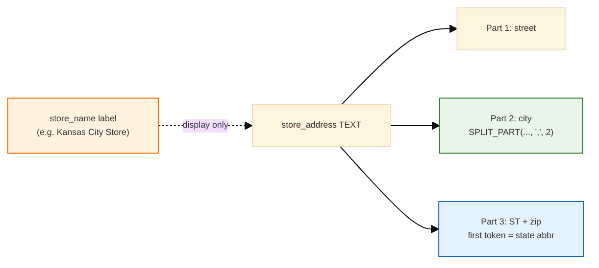
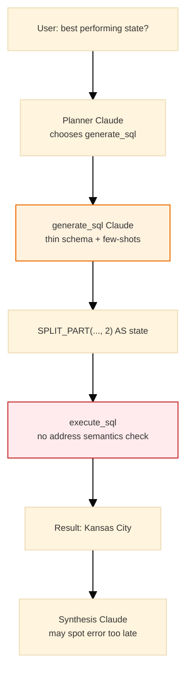

<h1 id="war-stories-other-title" style="color:#0d47a1;font-size:1.5em;font-weight:700;border-bottom:2px solid #90caf9;padding-bottom:0.25em;margin-top:0">WAR_STORIES_OTHER</h1>

A curated list of **non-trivial technical war stories**, capturing real lessons suitable for **senior-level interviews**.

**Authoring discipline:** `.cursor/rules/exwar-war-stories-extraction.mdc` and `.cursor/rules/mrkd-markdown-authoring.mdc`.

---

<h2 id="document-outline" style="color:#1565c0;font-size:1.22em;font-weight:650;border-left:4px solid #42a5f5;padding-left:10px;margin-top:1.1em">Document outline</h2>

1. [Reading guide](#reading-guide) — metadata and subsection labels.
2. [Story index](#story-index) — quick links to every story.

---

<h2 id="reading-guide" style="color:#1565c0;font-size:1.22em;font-weight:650;border-left:4px solid #42a5f5;padding-left:10px;margin-top:1.1em">Reading guide</h2>

<table>
<thead>
<tr style="background:#1565c0;color:white"><th style="padding:8px">Field / label</th><th style="padding:8px">Meaning</th></tr>
</thead>
<tbody>
<tr><td style="background:#e3f2fd;padding:8px"><strong>creation</strong> / <strong>last_updated</strong></td><td style="background:#e8f5e9;padding:8px">When the story was first captured and last revised (<code>&lt;YYMMDD&gt;</code> or <code>&lt;YYMMDD-HHMMSS&gt;</code>).</td></tr>
<tr><td style="background:#e3f2fd;padding:8px"><strong>keywords</strong></td><td style="background:#e8f5e9;padding:8px">Grep-friendly index into problem area and stack.</td></tr>
<tr><td style="background:#e3f2fd;padding:8px"><strong>difficulty</strong> / <strong>significance</strong></td><td style="background:#e8f5e9;padding:8px">Relative depth (1–10) and how reusable the lesson is for interviews.</td></tr>
<tr><td style="background:#e3f2fd;padding:8px"><strong>N.1–N.5</strong></td><td style="background:#e8f5e9;padding:8px">Context → Root Cause → Key Insight → Resolution → Takeaway.</td></tr>
</tbody>
</table>

---

<h2 id="story-index" style="color:#1565c0;font-size:1.22em;font-weight:650;border-left:4px solid #42a5f5;padding-left:10px;margin-top:1.1em">Story index</h2>

<table>
<thead>
<tr style="background:#1565c0;color:white"><th style="padding:8px">#</th><th style="padding:8px">Title</th><th style="padding:8px">Gist</th></tr>
</thead>
<tbody>
<tr><td style="background:#e3f2fd;padding:8px;text-align:right">1</td><td style="padding:8px;background:#fff3e0"><a href="#war-story-1">1. Scraping content from a shared ChatGPT link</a></td><td style="padding:8px;background:#fff3e0">Scraping content from a shared ChatGPT link</td></tr>
<tr><td style="background:#e3f2fd;padding:8px;text-align:right">2</td><td style="padding:8px;background:#e8f5e9"><a href="#war-story-2">2. Docker Desktop disk image, external SSD, and “phantom” disk usage</a></td><td style="padding:8px;background:#e8f5e9">Docker Desktop disk image, external SSD, and “phantom” disk usage</td></tr>
<tr><td style="background:#e3f2fd;padding:8px;text-align:right">3</td><td style="padding:8px;background:#fff3e0"><a href="#war-story-3">3. Execution Log token usage — dual key shapes and backend run totals</a></td><td style="padding:8px;background:#fff3e0">SSE showed 0 tokens while section 4 was non-zero; normalize + accumulate on the server</td></tr>
<tr><td style="background:#e3f2fd;padding:8px;text-align:right">4</td><td style="padding:8px;background:#e8f5e9"><a href="#war-story-4">4. City vs state in store_address — schema hints beat guessing SPLIT_PART indices</a></td><td style="padding:8px;background:#e8f5e9">LLM used index 2 for “state”; document 3-part address layout + few-shot city/state SQL</td></tr>
<tr><td style="background:#e3f2fd;padding:8px;text-align:right">5</td><td style="padding:8px;background:#fff3e0"><a href="#war-story-5">5. A capable Claude still needs semantic schema — thin column lists are not enough</a></td><td style="padding:8px;background:#fff3e0">generate_sql saw names/types only; world knowledge ≠ your table’s encoding</td></tr>
<tr><td style="background:#e3f2fd;padding:8px;text-align:right">6</td><td style="padding:8px;background:#e8f5e9"><a href="#war-story-6">6. Docker Desktop Kubernetes can keep a stale API image in containerd</a></td><td style="padding:8px;background:#e8f5e9"><code>docker build</code> updates Docker Engine but kube node may not pick up the new digest until import</td></tr>
</tbody>
</table>

---

<h2 id="war-story-1" style="color:#1565c0;margin-top:1.35em;margin-bottom:0.5em;font-weight:650;border-left:4px solid #42a5f5;padding-left:10px">1. Scraping content from a shared ChatGPT link</h2>

**creation:** `<260312>`

**last_updated:** `<260312>`

**keywords:** ChatGPT, shared links, JSON API, scraping, tooling

**difficulty:** 4  
**significance:** 6

---

<h3 id="war-story-1-sec-1" style="color:#00695c;margin-top:1.05em;margin-bottom:0.4em;font-weight:600">1.1 Context</h3>

We had a public ChatGPT share URL like:

- `https://chatgpt.com/share/69afe889-6418-800c-9b1c-c80026928878`

Opening this in the browser showed only the generic ChatGPT UI (header, “Chat history”), and fetching it via `curl` or tooling returned just the **HTML shell**, without any of the conversation text we actually wanted to reuse for CI/CD and feature-flag documentation.

---

<h3 id="war-story-1-sec-2" style="color:#00695c;margin-top:1.05em;margin-bottom:0.4em;font-weight:600">1.2 Root Cause</h3>

The share URL is **purely a UI endpoint**. The real conversation data lives behind a separate JSON endpoint:

- Extract the share ID:
  - `69afe889-6418-800c-9b1c-c80026928878`
- Use the backend endpoint instead:
  - `https://chatgpt.com/backend-api/share/69afe889-6418-800c-9b1c-c80026928878`

That endpoint returns a large JSON blob with a top-level `mapping` field. Each entry in `mapping` is a node in the conversation tree; some nodes contain a `message` with:

- `author.role` (`user`, `assistant`, or `system`)
- `content.parts` — a list of text chunks; the main text is in `parts[0]`

The HTML page we were hitting originally never exposed this JSON, so scraping it directly was a dead end.

---

<h3 id="war-story-1-sec-3" style="color:#00695c;margin-top:1.05em;margin-bottom:0.4em;font-weight:600">1.3 Key Insight</h3>

> For ChatGPT share links, the **only reliable source of conversation text is the backend JSON (`/backend-api/share/<id>`)**, not the rendered HTML page.

Once we saw the JSON structure, the problem became a straightforward “walk a mapping and print `content.parts[0]`” task. The trick was:

- Follow the ID from the pretty URL.
- Switch to the backend API.
- Iterate `mapping` instead of trying to scrape the UI.

---

<h3 id="war-story-1-sec-4" style="color:#00695c;margin-top:1.05em;margin-bottom:0.4em;font-weight:600">1.4 Resolution</h3>

Cursor saved the JSON to a local file under `agent-tools/`. We then used a small Python script to dump all messages.

From the project root:

```python
# One-off: python - << 'PY'  (from project root)
import json, os

path = os.path.join(
    os.path.expanduser("~"),
    ".cursor/projects/Users-jameswang9311-projects-fru-genai-analytics-new",
    "agent-tools",
    "9e406d97-133c-4de1-a5fb-da33314fd9d8.txt",
)

with open(path, "r") as f:
    data = json.load(f)

mapping = data.get("mapping", {})
for node_id, node in mapping.items():
    if not isinstance(node, dict):
        continue
    msg = node.get("message")
    if not msg:
        continue
    author = msg.get("author", {}).get("role")
    content = msg.get("content", {})
    parts = content.get("parts") or []
    if not parts:
        continue
    text = parts[0]
    print(f"\n----- MESSAGE (role={author}) -----")
    print(text)
# PY
```

What this does:

- Loads the saved JSON.
- Iterates over all nodes in `mapping`.
- Filters to nodes with a `message` and non-empty `content.parts`.
- Prints each message, prefixed by its `role` so prompts and answers are easy to distinguish.

This was enough to recover the full CI/CD + feature-flag discussion that the HTML share page hid.

---

<h3 id="war-story-1-sec-5" style="color:#00695c;margin-top:1.05em;margin-bottom:0.4em;font-weight:600">1.5 Takeaway</h3>

- **Don’t scrape the HTML shell** for ChatGPT shares; the real data is at `backend-api/share/<id>`.
- The JSON is **tree-structured**; for **correct order** and **multimodal** messages, use **`linear_conversation`** and the rules in **`chatgpt/playwright/extract_transcript.mjs`** (a naive `mapping` loop is not enough).
- **Live fetch** from automation often hits **403** / Cloudflare; the repo’s working path is **Playwright** in **`chatgpt/playwright/`** (see HOWTO).
- Once extracted, we could:
  - Rephrase and integrate the CI/CD + feature-flag insights into our own docs (`TODO_LEARNED_CICD.md`).
  - Keep our documentation **self-contained**, without relying on the external share remaining live.

This pattern is reusable any time we need to mine a shared ChatGPT conversation for architecture notes, war stories, or reference material.

**HOWTO + tooling:** [chatgpt/HOWTO_EXTRACT_CHATGPT.md](chatgpt/HOWTO_EXTRACT_CHATGPT.md) · [chatgpt/playwright/](chatgpt/playwright/) (`fetch_share.mjs`, `extract_transcript.mjs`)


---

<h2 id="war-story-2" style="color:#1565c0;margin-top:1.35em;margin-bottom:0.5em;font-weight:650;border-left:4px solid #42a5f5;padding-left:10px">2. Docker Desktop disk image, external SSD, and “phantom” disk usage</h2>

**creation:** `<260308>`  

**last_updated:** `<260308>`  

**keywords:** Docker Desktop, Docker.raw, sparse file, external SSD, APFS, macOS, disk space debugging  

**difficulty:** 6  
**significance:** 7

---

<h3 id="war-story-2-sec-1" style="color:#00695c;margin-top:1.05em;margin-bottom:0.4em;font-weight:600">2.1 Context</h3>

We were running Docker Desktop with Kubernetes (kind) on a MacBook Air. Docker images and clusters were eating a lot of space, so we decided to move Docker Desktop’s disk image (`Docker.raw`) off the internal SSD onto an external SSD mounted at `/Volumes/Doc-Bk-JJ-SDD-1-APFS/`.

We:

- Changed **Settings → Resources → Advanced → Disk image location** to the external volume.  
- Manually copied `~/Library/Containers/com.docker.docker/Data/vms/0/data/Docker.raw` to the SSD.  
- Deleted the original `Docker.raw` on the internal disk expecting ~16–20 GB to be freed.

Instead, disk space behaved strangely:

- The free space barely moved at first.  
- Docker kept “recreating” a large `Docker.raw` on the internal disk.  
- At one point, there were **multiple `Docker.raw` files** on the SSD (`DockerDesktop/Docker.raw` and `DockerDesktop/DockerDesktop/Docker.raw`), and Docker’s VM was pointing at the nested one.

---

<h3 id="war-story-2-sec-2" style="color:#00695c;margin-top:1.05em;margin-bottom:0.4em;font-weight:600">2.2 Root Causes</h3>

There were **three overlapping root causes**:

- **1) Sparse file vs. actual allocation**  
  - `du -sh Docker.raw` reported 16–228 GB, but APFS sparse files meant the *real* used blocks were much smaller (e.g. ~1 GB initially).  
  - Deleting a sparse file only freed the actually allocated blocks, not the apparent size, so the “freed GB” was less than it looked.

- **2) Open file handles preventing space from being released**  
  - We deleted `Docker.raw` while background `cp -Rp` processes were still copying it from the internal disk to the SSD.  
  - `lsof` showed `cp` still had `/Users/.../vms/0/data/Docker.raw` open. On Unix, deleting a file only unlinks the name; disk space is not reclaimed until all open handles close.  
  - Killing the `cp` processes (`kill -9 <pid>`) finally freed ~19 GB.

- **3) Misconfigured / reverted Docker disk image location**  
  - Docker sometimes started when the external SSD wasn’t mounted, or after an upgrade, and silently fell back to the default `~/Library/Containers/com.docker.docker/Data/vms/0/data/Docker.raw`.  
  - At another point, we accidentally pointed Docker at `/Volumes/.../DockerDesktop_raw/DockerDesktop`, and a script created a nested path `DockerDesktop/DockerDesktop/Docker.raw`.  
  - As a result, Docker kept **recreating a new local `Docker.raw`** on the internal disk, slowly eroding space again.

---

<h3 id="war-story-2-sec-3" style="color:#00695c;margin-top:1.05em;margin-bottom:0.4em;font-weight:600">2.3 Resolution</h3>

We stabilized the setup with a combination of **process, path, and tooling fixes**:

- **Freeing the “stuck” space**
  - Used `lsof +L1` and `lsof | grep 'Docker.raw'` to find processes that still had deleted `Docker.raw` open.  
  - Killed the offending `cp` processes so the kernel could finally release the underlying blocks.  
  - Confirmed via `df -h /` that free space jumped from ~355 MB to ~19 GB.

- **Correctly relocating Docker to the SSD**
  - Ensured the external SSD was mounted **before starting Docker**.  
  - In Docker Desktop settings, set *Disk image location* to `/Volumes/Doc-Bk-JJ-SDD-1-APFS/DockerDesktop_raw`.  
  - Quit Docker, removed any stray `Docker.raw` on the internal disk, and let Docker create a new image on the SSD only.

- **Recovering from a likely-corrupted SSD `Docker.raw`**
  - Noticed that the nested path `.../DockerDesktop/DockerDesktop/Docker.raw` was smaller and had been mid-copy when `cp` was killed → likely corrupted.  
  - Chose **Option B**: delete that nested file and let Docker create a fresh empty disk on the SSD, at the cost of repulling images.

---

<h3 id="war-story-2-sec-4" style="color:#00695c;margin-top:1.05em;margin-bottom:0.4em;font-weight:600">2.4 Takeaways</h3>

- **Deleting a big file ≠ instant space back** if any process still has it open; use `lsof +L1` before assuming the disk is “lying”.  
- **Sparse files** (like `Docker.raw`) can be hundreds of GB logically but only a few GB physically; always trust `du` and `df`, not just `ls -lh`.  
- When relocating Docker Desktop:
  - Make sure the external volume is mounted *before* Docker starts.  
  - After upgrades or reboots, re-check the disk image location; Docker may revert to the default silently.  
  - Avoid copying `Docker.raw` while Docker is running; treat it like a VM disk, not a regular file.
- In stubborn “Docker is wedged” situations, keep a script like `docker-unstick-desktop-start.sh` and clear, repeatable steps for:
  - Quitting Docker,  
  - Killing backend processes,  
  - Verifying no one is holding `Docker.raw`,  
  - Then safely deleting or relocating the disk image.

---

<h2 id="war-story-3" style="color:#1565c0;margin-top:1.35em;margin-bottom:0.5em;font-weight:650;border-left:4px solid #42a5f5;padding-left:10px">3. Execution Log token usage — dual key shapes and backend run totals</h2>

**creation:** `<260521>`

**last_updated:** `<260521>`

**keywords:** SSE, execution log, token usage, design, agent, pseudo_tool, normalize, backend-authoritative

**difficulty:** 5  
**significance:** 7

---

<h3 id="war-story-3-sec-1" style="color:#00695c;margin-top:1.05em;margin-bottom:0.4em;font-weight:600">3.1 Context</h3>

The Execution Log panel streams agent steps over SSE (`tool_call_complete` per tool, `complete` at the end). Users expected **per-step** LLM token lines and a **section 4 total** that matched the sum of every LLM call (planning, `generate_sql`, synthesis). Instead, synthesis rows showed `0, 0, 0` while section 4 sometimes showed non-zero totals — and planning tokens never appeared at all.

---

<h3 id="war-story-3-sec-2" style="color:#00695c;margin-top:1.05em;margin-bottom:0.4em;font-weight:600">3.2 Root Cause</h3>

Three separate issues compounded:

| Layer | Bug |
|-------|-----|
| **Claude client** | Returns `{input, output, total}` on each `claude_complete` call. |
| **Synthesis SSE** | Passed that raw dict through; the UI read `input_tokens` / `output_tokens` / `total_tokens` → all **zero**. |
| **Section 4** | `complete.token_usage` was built from **synthesis only**, not planning or `generate_sql`. |
| **Planning** | Tokens logged at DEBUG; no `tool_call_complete` row, so the panel had nothing to render. |

A frontend-only fix (mapping keys in React) would still leave section 4 wrong and would not survive stream disconnects. Client-side summation would diverge from the API’s non-stream `POST /query` response.

---

<h3 id="war-story-3-sec-3" style="color:#00695c;margin-top:1.05em;margin-bottom:0.4em;font-weight:600">3.3 Key Insight</h3>

Treat the Execution Log as a **display contract** owned by the backend:

1. **One canonical shape** — `normalize_token_usage()` maps both Claude and normalized keys to `{input_tokens, output_tokens, total_tokens}` before any SSE payload or logger call.
2. **One accumulator** — `run_token_usage` in `process_query` adds every LLM step; `complete` and `POST /query` both return that sum.
3. **Pseudo-tools for invisible LLM work** — `pseudo_tool#llm_plan` streams planning like synthesis (`pseudo_tool#llm_synthesize_answer`) without registering a real agent tool.

Non-LLM steps (`execute_sql`) omit usage or show `(no token info from the LLM)` in the UI.

---

<h3 id="war-story-3-sec-4" style="color:#00695c;margin-top:1.05em;margin-bottom:0.4em;font-weight:600">3.4 Resolution</h3>

- Added `normalize_token_usage` / `add_token_usage` in `display_truncate.py`.
- After each planning `claude_complete`, emit `tool_call_complete` with `tool: pseudo_tool#llm_plan`.
- `SQLGeneratorTool` returns `tokens` in tool output; SSE builder attaches normalized `output.token_usage` (agent `tool_results` summaries unchanged).
- Synthesis and `logger.log_synthesis` receive normalized usage → server log `Tokens:` matches the UI.
- Integration tests in `tests/integration/test_exec_log_sse.py` assert quoted SQL, normalized keys on LLM rows, and `complete.total_tokens == sum(step totals)`.

---

<h3 id="war-story-3-sec-5" style="color:#00695c;margin-top:1.05em;margin-bottom:0.4em;font-weight:600">3.5 Takeaway</h3>

When the same metric crosses **multiple event types** (per-step SSE + final summary + REST JSON), pick a **single server-side normalizer and accumulator** early. Dual key shapes from upstream SDKs are common; fixing them in the UI alone hides half the bug and breaks DRY between stream and non-stream paths.

---

<h2 id="war-story-4" style="color:#1565c0;margin-top:1.35em;margin-bottom:0.5em;font-weight:650;border-left:4px solid #42a5f5;padding-left:10px">4. City vs state in store_address — schema hints beat guessing SPLIT_PART indices</h2>

**creation:** 260521-143000

**last_updated:** 260521-143000

**keywords:** design, data model design, text-to-sql, PostgreSQL, SPLIT_PART, store_address, schema hints, LLM agent, geography, few-shot prompts

**difficulty:** 5

**significance:** 7

---

<h3 id="war-story-4-sec-1" style="color:#00695c;margin-top:1.05em;margin-bottom:0.4em;font-weight:600">4.1 Context</h3>

FRU sales rows store location in a single `store_address` TEXT column (US mailing layout) plus a separate `store_name` display label. After the PostgreSQL dialect migration (`SUBSTRING_INDEX` → `SPLIT_PART`), geography questions still failed in production:

- **“Which US state has the highest total sales revenue?”** → SQL grouped by `SPLIT_PART(store_address, ',', 2)` and the answer named **Kansas City** (a city, not a state abbreviation).
- **“Which city performed the best?”** → sometimes confused with `store_name` (e.g. `"Kansas City Store"`) instead of parsing the address.

The Execution Log showed **valid PostgreSQL** that executed cleanly — wrong semantics, not a syntax error.

---

<h3 id="war-story-4-sec-2" style="color:#00695c;margin-top:1.05em;margin-bottom:0.4em;font-weight:600">4.2 Root Cause</h3>

Three traps stacked:

| Trap | What happened |
| --- | --- |
| **Opaque composite column** | Schema listed `store_address: TEXT` with no decomposition contract. The model had to invent which comma-separated segment meant “city” vs “state”. |
| **Off-by-one intuition on indices** | For `"123 Broadway, New York, NY 10001"`, index **2** is the **city** (`New York`). State abbreviation lives in part **3** as the first token before the zip (`NY`). The model reused index 2 for “state” because it is the second human-visible segment after the street. |
| **Misleading display field** | `store_name` values like `"Kansas City Store"` look geographic but are marketing labels — not a normalized city or state column. |

Sample row from `core_app/data/raw/fridge_sales_with_rating.csv`:

```text
STORE_NAME=Chicago Store
STORE_ADDRESS="456 Michigan Ave, Chicago, IL 60601"
```

Without an explicit layout, the LLM treats `store_address` like a bag of tokens and picks the most convenient `SPLIT_PART` index for the question wording.

---

<h3 id="war-story-4-sec-3" style="color:#00695c;margin-top:1.05em;margin-bottom:0.4em;font-weight:600">4.3 Key Insight</h3>

<span style="background:#fff3e0;padding:2px 6px">For text-to-SQL over composite TEXT fields, document the **physical layout** in the schema prompt — indices, delimiters, and anti-patterns — not just the column type.</span>

A column name like `store_address` suggests meaning to humans but not to the model. The fix is a **decomposition contract**: fixed 3-part format, which index is city, how to extract state from part 3, and explicit guidance to prefer parsed address over `store_name` for geography.

---

<h3 id="war-story-4-sec-4" style="color:#00695c;margin-top:1.05em;margin-bottom:0.4em;font-weight:600">4.4 Resolution</h3>

Documented the layout in **three places** so planner, SQL generator, and synthesis stay aligned:

<table>
<thead>
<tr style="background:#1565c0;color:white"><th style="padding:8px">Layer</th><th style="padding:8px">What we added</th></tr>
</thead>
<tbody>
<tr><td style="background:#e3f2fd;padding:8px"><code>sql_generator_tool._format_schema_info()</code></td><td style="background:#e8f5e9;padding:8px">3-part US format <code>"&lt;street&gt;, &lt;city&gt;, &lt;ST&gt; &lt;zip&gt;"</code>; index 2 = city; index 3 first token = state abbr; <code>store_name</code> is display-only.</td></tr>
<tr><td style="background:#e3f2fd;padding:8px"><code>sql_generator_tool</code> rules + few-shot</td><td style="background:#e8f5e9;padding:8px">Separate city and state examples; rule <strong>“Index 2 is city, NOT state”</strong>; state uses nested <code>TRIM(SPLIT_PART(TRIM(SPLIT_PART(..., 3)), ' ', 1))</code>.</td></tr>
<tr><td style="background:#e3f2fd;padding:8px"><code>prompts.get_agent_system_prompt</code></td><td style="background:#e8f5e9;padding:8px">Same <code>store_address</code> hints for the query agent (planner / synthesis), not only the SQL tool.</td></tr>
</tbody>
</table>

**Address decomposition (canonical):**



**Representative SQL (state vs city):**

```sql
-- City (index 2)
SELECT TRIM(SPLIT_PART(store_address, ',', 2)) AS city, SUM(price) AS total_sales
FROM fru_sales_embeddings
GROUP BY TRIM(SPLIT_PART(store_address, ',', 2));

-- State abbreviation (first token of part 3 — NOT index 2)
SELECT TRIM(SPLIT_PART(TRIM(SPLIT_PART(store_address, ',', 3)), ' ', 1)) AS state_abbr,
       SUM(price) AS total_sales
FROM fru_sales_embeddings
GROUP BY TRIM(SPLIT_PART(TRIM(SPLIT_PART(store_address, ',', 3)), ' ', 1));
```

**Verification:**

- Unit: `tests/unit/core_app/backend/test_sql_generator_postgresql.py` — `test_schema_prompt_documents_store_address_city_and_state` asserts format docs and **“Index 2 is city, NOT state”** in the generator prompt.
- Live: “which state performed the best” → **CA**; “which city performed the best” → **Houston** / **Kansas City** per parsed city column (not conflated with state).

---

<h3 id="war-story-4-sec-5" style="color:#00695c;margin-top:1.05em;margin-bottom:0.4em;font-weight:600">4.5 Takeaway</h3>

When analytics data packs multiple facts into one TEXT column, **teach the decomposition in the prompt** (layout table, worked examples, and explicit “do not use index N for X”). Dialect rewrites fix *how* SQL runs; they do not fix *what* each comma-separated part means — that contract belongs in schema hints shared across every agent surface that touches geography.

---

<h2 id="war-story-5" style="color:#1565c0;margin-top:1.35em;margin-bottom:0.5em;font-weight:650;border-left:4px solid #42a5f5;padding-left:10px">5. A capable Claude still needs semantic schema — thin column lists are not enough</h2>

**creation:** 260521-150000

**last_updated:** 260521-150000

**keywords:** design, system design, text-to-sql, Claude, schema hints, few-shot prompts, LLM agent, prompt engineering, generate_sql, under-specified context

**difficulty:** 4

**significance:** 8

---

<h3 id="war-story-5-sec-1" style="color:#00695c;margin-top:1.05em;margin-bottom:0.4em;font-weight:600">5.1 Context</h3>

After a bad “best performing **state**” answer returned **Kansas City**, the natural reaction was: *“A smart model should know how to find state in an address — we sent this to Claude, right?”*

Yes — but not in the way people imagine. The query agent **does** call Claude. Geography SQL is produced by a **second**, dedicated `claude_complete` inside `SQLGeneratorTool.generate_sql`, with its **own** system prompt built from `schema_info` and few-shot examples. The planner never pastes sample rows into that call.

Before the schema-hint fix ([story 4](#war-story-4)), that prompt was essentially:

```text
Table: fru_sales_embeddings
  - store_name: TEXT
  - store_address: TEXT
  - price: NUMERIC
  …
```

No sample values. No `"street, city, ST zip"` layout. No worked “extract state abbreviation” example. The model had column **names** and **types** — not the **encoding** your team chose for this dataset.

---

<h3 id="war-story-5-sec-2" style="color:#00695c;margin-top:1.05em;margin-bottom:0.4em;font-weight:600">5.2 Root Cause</h3>

<span style="background:#fff3e0;padding:2px 6px">Model capability and model **context** are different problems.</span> Claude can reason about US addresses in the abstract. It cannot reliably infer **your** comma indices, **your** decision to pack city+state+zip into one TEXT column, or **your** few-shot habits — unless you put that in the prompt.

What the SQL generator actually had to work with:

<table>
<thead>
<tr style="background:#1565c0;color:white"><th style="padding:8px">Prompt ingredient</th><th style="padding:8px">Before fix</th><th style="padding:8px">Effect on “best state” query</th></tr>
</thead>
<tbody>
<tr><td style="background:#e3f2fd;padding:8px">Schema block</td><td style="background:#ffebee;padding:8px"><code>store_address: TEXT</code> only</td><td style="background:#ffebee;padding:8px">Model invents parsing; aliases index 2 as <code>state</code></td></tr>
<tr><td style="background:#e3f2fd;padding:8px">Sample rows</td><td style="background:#ffebee;padding:8px">None in generator prompt</td><td style="background:#ffebee;padding:8px">No anchor for <code>852 Main St, Kansas City, MO 64105</code> shape</td></tr>
<tr><td style="background:#e3f2fd;padding:8px">Few-shot: city</td><td style="background:#fff3e0;padding:8px">Often <code>store_name</code></td><td style="background:#fff3e0;padding:8px">Teaches display label, not parsed city</td></tr>
<tr><td style="background:#e3f2fd;padding:8px">Few-shot: region</td><td style="background:#fff3e0;padding:8px">Big <code>CASE</code> + <code>LIKE</code> on full address</td><td style="background:#fff3e0;padding:8px">Different pattern than state-abbr extraction</td></tr>
<tr><td style="background:#e3f2fd;padding:8px">Few-shot: state</td><td style="background:#ffebee;padding:8px">Missing</td><td style="background:#ffebee;padding:8px">No demonstrated <code>SPLIT_PART</code> recipe for ST</td></tr>
<tr><td style="background:#e3f2fd;padding:8px"><code>execute_sql</code></td><td style="background:#ffebee;padding:8px">Runs any valid SELECT</td><td style="background:#ffebee;padding:8px">Wrong semantics execute cleanly; Kansas City “wins”</td></tr>
</tbody>
</table>

The failure looked like “the model doesn’t understand addresses.” Mechanically it was **under-specified text-to-SQL**: plausible SQL, wrong column semantics. Synthesis sometimes **noticed** the mistake (“Kansas City … appears to be a city rather than a state”) — but only **after** bad SQL had already run and shaped the answer.



---

<h3 id="war-story-5-sec-3" style="color:#00695c;margin-top:1.05em;margin-bottom:0.4em;font-weight:600">5.3 Key Insight</h3>

<span style="background:#e8f5e9;padding:2px 6px">Upgrading the model does not replace **semantic schema documentation**.</span>

For agentic analytics, treat the SQL generator prompt like an **API contract**:

1. **Physical layout** for composite fields (format string, indices, anti-patterns).
2. **Worked examples** per question family (city vs state vs region — not interchangeable).
3. **Consistency** across surfaces (`sql_generator_tool`, `prompts.py` agent schema, tests that assert hints exist).

World knowledge fills gaps when data is conventional. Enterprise tables are often **conventional-looking but idiosyncratic** — one TEXT column, marketing `store_name`, comma rules that differ from “obvious” US parsing. The model must be told **your** rules, not assumed to discover them.

---

<h3 id="war-story-5-sec-4" style="color:#00695c;margin-top:1.05em;margin-bottom:0.4em;font-weight:600">5.4 Resolution</h3>

Enriched the generator and agent prompts (see [story 4](#war-story-4) for the address layout detail):

| Enhancement | Where | Why it matters |
| --- | --- | --- |
| **Semantic `store_address` block** | `_format_schema_info()`, `prompts.py` | Explains 3-part layout; city = index 2; state abbr = first token of part 3; <code>store_name</code> is display-only |
| **Explicit anti-pattern** | SQL generator rules | **“Index 2 is city, NOT state”** — blocks the exact failure mode |
| **Paired few-shots** | `sql_generator_tool.py` | Separate “highest city” and “highest state” examples with correct expressions |
| **Regression guard** | `test_schema_prompt_documents_store_address_city_and_state` | Prompt drift is caught in CI — thin schema cannot silently return |

**Thin vs enriched schema (what Claude sees):**

```text
# Thin (insufficient)
store_address: TEXT

# Enriched (what we ship now)
store_address format: "<street>, <city>, <ST> <zip>"
  Part 2 (index 2): city — TRIM(SPLIT_PART(store_address, ',', 2))
  Part 3: state abbr — TRIM(SPLIT_PART(TRIM(SPLIT_PART(store_address, ',', 3)), ' ', 1))
  store_name: display label only; prefer parsed address for geography
```

Longer-term alternative (not required for the lesson): normalized `city` / `state_abbr` columns or a DB view so the model never parses strings. Until then, **prompt-level semantic schema is mandatory**, not a nice-to-have.

**Verification:** Live queries — “which state performed the best” → **CA**; unit test locks prompt content.

---

<h3 id="war-story-5-sec-5" style="color:#00695c;margin-top:1.05em;margin-bottom:0.4em;font-weight:600">5.5 Takeaway</h3>

If you pay for a frontier model and still get confidently wrong analytics, check **what you told it about your tables** before blaming model IQ. Text-to-SQL at production quality needs **semantic schema enrichment** — layout, examples, and tests — on top of raw column lists. Smarter models reduce variance; they do not absolve you of encoding **your** data model in the prompt.

---

<h2 id="war-story-6" style="color:#1565c0;margin-top:1.35em;margin-bottom:0.5em;font-weight:650;border-left:4px solid #42a5f5;padding-left:10px">6. Docker Desktop Kubernetes can keep a stale API image in containerd</h2>

**creation:** 260521 · **last_updated:** 260521 · **keywords:** docker desktop, kubernetes, containerd, local deploy, stale image, fru-api · **difficulty:** 6 · **significance:** 8

<h3 id="war-story-6-sec-1" style="color:#00695c;margin-top:1.05em;margin-bottom:0.4em;font-weight:600">6.1 Context</h3>

Local **kube** scope builds `fru-api:local` with `docker build`, applies manifests, and rolls out `deployment/fru-api`. After embedding-profile and SQL-agent changes, the API on NodePort `30080` still behaved like an **older** build: missing schema hints, wrong SQL dialect helpers, and no profile-aware semantic search — even though `docker images` showed a fresh `fru-api:local` on the host.

<h3 id="war-story-6-sec-2" style="color:#00695c;margin-top:1.05em;margin-bottom:0.4em;font-weight:600">6.2 Root Cause</h3>

Docker Desktop’s embedded Kubernetes node (`desktop-control-plane`) runs **containerd**, not the Docker Engine graph the CLI updates. `kubectl rollout restart` re-pulls the image **from the node’s image store**. If that store still holds an older digest tagged `fru-api:local`, pods come back with stale code while `docker build` on the host succeeded.

<h3 id="war-story-6-sec-3" style="color:#00695c;margin-top:1.05em;margin-bottom:0.4em;font-weight:600">6.3 Key Insight</h3>

“Image rebuilt” ≠ “kube workload updated” on Docker Desktop. Treat **import into the k8s node** as part of the local kube deploy loop whenever API behavior does not match the latest build.

<h3 id="war-story-6-sec-4" style="color:#00695c;margin-top:1.05em;margin-bottom:0.4em;font-weight:600">6.4 Resolution</h3>

After `docker build -t fru-api:local`, pipe the tarball into the control-plane containerd namespace:

```bash
docker save fru-api:local | docker exec -i desktop-control-plane ctr -n k8s.io images import -
kubectl rollout restart deployment/fru-api -n fru-kube
```

Automated in `tools/local/deploy.py` (`_import_api_image_to_kube_node()`). Documented in `docs/BYTEPLUS_AWS_GCP_REFERENCE.md` and the ModelArk refactor plan.

<h3 id="war-story-6-sec-5" style="color:#00695c;margin-top:1.05em;margin-bottom:0.4em;font-weight:600">6.5 Takeaway</h3>

For local k8s on Docker Desktop, add an explicit **host → node image sync** step to your deploy checklist. Symptom: code changes “do nothing” after rollout; fix: verify pod image digest or import before blaming application logic.
